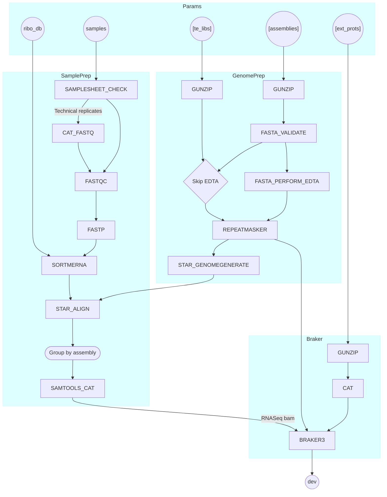

# PAN-GENE
A NextFlow pipeline for pan-genome annotation.

## Pipeline Flowchart



## Plant&Food Users

Configure the pipeline by modifying `nextflow.config` and submit to SLURM for execution.

```bash
sbatch ./pan_gene_pfr.sh 
```


## Third-party Sources

Some software components of this pipeline have been adopted from following third-party sources:

1. nf-core [MIT](https://github.com/nf-core/modules/blob/master/LICENSE): https://github.com/nf-core/modules

> **The nf-core framework for community-curated bioinformatics pipelines.**
>
> Philip Ewels, Alexander Peltzer, Sven Fillinger, Harshil Patel, Johannes Alneberg, Andreas Wilm, Maxime Ulysse Garcia, Paolo Di Tommaso & Sven Nahnsen.
>
> _Nat Biotechnol._ 2020 Feb 13. doi: [10.1038/s41587-020-0439-x](https://dx.doi.org/10.1038/s41587-020-0439-x).

2. nf-core/rnaseq [MIT](https://github.com/nf-core/rnaseq/blob/master/LICENSE): https://github.com/nf-core/rnaseq
3. rewarewaannotation [MIT](https://github.com/kherronism/rewarewaannotation/blob/master/LICENSE): https://github.com/kherronism/rewarewaannotation
4. assembly_qc [GPL-3.0](https://github.com/Plant-Food-Research-Open/assembly_qc/blob/main/LICENSE): https://github.com/Plant-Food-Research-Open/assembly_qc