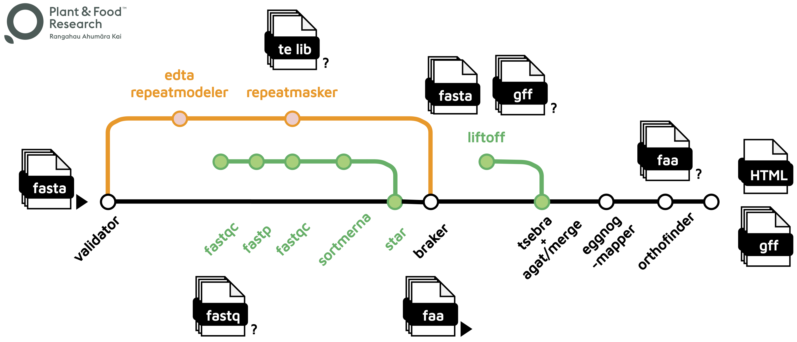

[](https://github.com/plant-food-research-open/genepal/actions/workflows/ci.yml)
[](https://github.com/plant-food-research-open/genepal/actions/workflows/linting.yml)[](https://doi.org/10.5281/zenodo.XXXXXXX)
[](https://www.nf-test.com)

[](https://www.nextflow.io/)
[](https://docs.conda.io/en/latest/)
[](https://www.docker.com/)
[](https://sylabs.io/docs/)
[](https://cloud.seqera.io/launch?pipeline=https://github.com/plant-food-research-open/genepal)

## Introduction

**plant-food-research-open/genepal** is a bioinformatics pipeline for single genome, multiple genomes and pan-genome annotation. An overview is shown in the [Pipeline Flowchart](#pipeline-flowchart) and the references for the tools are listed in [CITATIONS.md](./CITATIONS.md).

## Pipeline Flowchart

<p align="center"></p>

- [FASTA VALIDATOR](https://github.com/linsalrob/fasta_validator): Validate genome fasta
- [REPEATMODELER](https://github.com/Dfam-consortium/RepeatModeler) or [EDTA](https://github.com/oushujun/EDTA): Create TE library
- [REPEATMASKER](https://github.com/rmhubley/RepeatMasker): Soft mask the genome fasta
- [FASTQC](https://www.bioinformatics.babraham.ac.uk/projects/fastqc), [FASTP](https://github.com/OpenGene/fastp), [SORTMERNA](https://github.com/sortmerna/sortmerna): QC, trim and filter RNASeq evidence
- [STAR](https://github.com/alexdobin/STAR): RNASeq alignment
- [BRAKER](https://github.com/Gaius-Augustus/BRAKER): Annotate the genome fasta
- [LIFTOFF](https://github.com/agshumate/Liftoff): Liftoff annotations from reference genome fasta/gff
- [TSEBRA](https://github.com/Gaius-Augustus/TSEBRA), [AGAT](https://github.com/NBISweden/AGAT): Merge BRAKER and Liftoff annotations
- [EGGNOG-MAPPER](https://github.com/eggnogdb/eggnog-mapper): Add functional annotation to gff
- [ORTHOFINDER](https://github.com/davidemms/OrthoFinder): Perform phylogenetic orthology inference across input genomes
- [GENOMETOOLS](https://github.com/genometools/genometools), [GFFREAD](https://github.com/gpertea/gffread): Final GFF format validation and extraction of protein sequences
- [BUSCO](https://gitlab.com/ezlab/busco): Completeness statistics for genome and annotation through proteins

## Usage

Refer to [usage](./docs/usage.md), [parameters](./docs/parameters.md) and [output](./docs/output.md) documents for details.

> [!NOTE]
> If you are new to Nextflow and nf-core, please refer to [this page](https://nf-co.re/docs/usage/installation) on how to set-up Nextflow. Make sure to [test your setup](https://nf-co.re/docs/usage/introduction#how-to-run-a-pipeline) with `-profile test` before running the workflow on actual data.

First, prepare an assemblysheet with your input genomes that looks as follows:

`assemblysheet.csv`:

```csv
tag         ,fasta              ,is_masked
a_thaliana  ,/path/to/genome.fa ,yes
```

Each row represents an input genome and the fields are:

- `tag:` A unique tag which represents the genome throughout the pipeline
- `fasta:` fasta file for the genome
- `is_masked`: yes or no to denote whether the fasta file is already masked or not

At minimum, a file with proteins as evidence is also required. Now, you can run the pipeline using:

```bash
nextflow run plant-food-research-open/genepal \
  -profile <docker/singularity/.../institute> \
  --input assemblysheet.csv \
  --protein_evidence proteins.faa \
  --outdir <OUTDIR>
```

> [!WARNING]
> Please provide pipeline parameters via the CLI or Nextflow `-params-file` option. Custom config files including those provided by the `-c` Nextflow option can be used to provide any configuration _**except for parameters**_;
> see [docs](https://nf-co.re/usage/configuration#custom-configuration-files).

### Plant&Food Users

Download the pipeline to your `/workspace/$USER` folder. Change the parameters defined in the [pfr/params.json](./pfr/params.json) file. Submit the pipeline to SLURM for execution.

```bash
sbatch ./pfr_genepal
```

## Credits

plant-food-research-open/genepal workflows were originally scripted by Jason Shiller ([@jasonshiller](https://github.com/jasonshiller)). Usman Rashid ([@gallvp](https://github.com/gallvp)) wrote the Nextflow pipeline.

We thank the following people for their extensive assistance in the development of this pipeline:

- Cecilia Deng [@CeciliaDeng](https://github.com/CeciliaDeng)
- Charles David [@charlesdavid](https://github.com/charlesdavid)
- Chen Wu [@christinawu2008](https://github.com/christinawu2008)
- Leonardo Salgado [@leorippel](https://github.com/leorippel)
- Ross Crowhurst [@rosscrowhurst](https://github.com/rosscrowhurst)
- Susan Thomson [@cflsjt](https://github.com/cflsjt)
- Ting-Hsuan Chen [@ting-hsuan-chen](https://github.com/ting-hsuan-chen)

The pipeline uses nf-core modules contributed by following authors:

<a href="https://github.com/gallvp"></a>
<a href="https://github.com/drpatelh"></a>
<a href="https://github.com/kevinmenden"></a>
<a href="https://github.com/adamrtalbot"></a>
<a href="https://github.com/toniher"></a>
<a href="https://github.com/joseespinosa"></a>
<a href="https://github.com/grst"></a>
<a href="https://github.com/edmundmiller"></a>
<a href="https://github.com/maxulysse"></a>
<a href="https://github.com/kherronism"></a>
<a href="https://github.com/vagkaratzas"></a>
<a href="https://github.com/robsyme"></a>
<a href="https://github.com/priyanka-surana"></a>
<a href="https://github.com/praveenraj2018"></a>
<a href="https://github.com/muffato"></a>
<a href="https://github.com/matthdsm"></a>
<a href="https://github.com/mashehu"></a>
<a href="https://github.com/mahesh-panchal"></a>
<a href="https://github.com/jvhagey"></a>
<a href="https://github.com/jfy133"></a>
<a href="https://github.com/jemten"></a>
<a href="https://github.com/friederikehanssen"></a>
<a href="https://github.com/felixkrueger"></a>
<a href="https://github.com/ewels"></a>
<a href="https://github.com/erikrikarddaniel"></a>
<a href="https://github.com/charles-plessy"></a>

## Contributions and Support

If you would like to contribute to this pipeline, please see the [contributing guidelines](.github/CONTRIBUTING.md).

## Citations

<!-- TODO nf-core: Add citation for pipeline after first release. Uncomment lines below and update Zenodo doi and badge at the top of this file. -->
<!-- If you use plant-food-research-open/genepal for your analysis, please cite it using the following doi: [10.5281/zenodo.XXXXXX](https://doi.org/10.5281/zenodo.XXXXXX) -->

An extensive list of references for the tools used by the pipeline can be found in the [`CITATIONS.md`](CITATIONS.md) file.

This pipeline uses code and infrastructure developed and maintained by the [nf-core](https://nf-co.re) community, reused here under the [MIT license](https://github.com/nf-core/tools/blob/master/LICENSE).

> **The nf-core framework for community-curated bioinformatics pipelines.**
>
> Philip Ewels, Alexander Peltzer, Sven Fillinger, Harshil Patel, Johannes Alneberg, Andreas Wilm, Maxime Ulysse Garcia, Paolo Di Tommaso & Sven Nahnsen.
>
> _Nat Biotechnol._ 2020 Feb 13. doi: [10.1038/s41587-020-0439-x](https://dx.doi.org/10.1038/s41587-020-0439-x).
