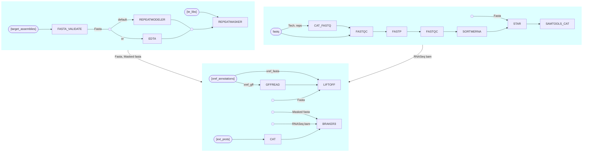

# PANGENE

[](https://github.com/PlantandFoodResearch/pangene/actions/workflows/test.yml)

A NextFlow pipeline for pan-genome annotation. It can also be used for annotation of a single genome.

## Pipeline Flowchart



## Alpha Release

This release is not fully documented and under alpha testing by the Bioinformatics Team. There are several [outstanding issues](https://github.com/PlantandFoodResearch/pangene/issues) which will be addressed before a general release.

## Plant&Food Users

Download the pipeline to your `/workspace/$USER` folder. Change the parameters defined in the [pfr/params.json](./pfr/params.json) file. Submit the pipeline to SLURM for execution. For a description of the parameters, see [parameters](./docs/parameters.md).

```bash
sbatch ./pfr_pangene
```

## Credits

plantandfoodresearch/pangene scripts were originally written by Jason Shiller. Usman Rashid wrote the NextFLow pipeline.

We thank the following people for their extensive assistance in the development of this pipeline.

- Cecilia Deng [@CeciliaDeng](https://github.com/CeciliaDeng)
- Charles David [@charlesdavid](https://github.com/charlesdavid)
- Chen Wu [@christinawu2008](https://github.com/christinawu2008)
- Leonardo Salgado [@leorippel](https://github.com/leorippel)
- Ross Crowhurst [@rosscrowhurst](https://github.com/rosscrowhurst)
- Susan Thomson [@cflsjt](https://github.com/cflsjt)
- Ting-Hsuan Chen [@ting-hsuan-chen](https://github.com/ting-hsuan-chen)

The pipeline uses nf-core modules contributed by following authors.

<a href="https://github.com/drpatelh"></a>
<a href="https://github.com/edmundmiller"></a>
<a href="https://github.com/erikrikarddaniel"></a>
<a href="https://github.com/ewels"></a>
<a href="https://github.com/felixkrueger"></a>
<a href="https://github.com/friederikehanssen"></a>
<a href="https://github.com/gallvp"></a>
<a href="https://github.com/grst"></a>
<a href="https://github.com/jemten"></a>
<a href="https://github.com/jfy133"></a>
<a href="https://github.com/joseespinosa"></a>
<a href="https://github.com/kevinmenden"></a>
<a href="https://github.com/kherronism"></a>
<a href="https://github.com/mashehu"></a>
<a href="https://github.com/matthdsm"></a>
<a href="https://github.com/praveenraj2018"></a>
<a href="https://github.com/robsyme"></a>
<a href="https://github.com/toniher"></a>
<a href="https://github.com/vagkaratzas"></a>

## Citations

This pipeline uses code and infrastructure developed and maintained by the [nf-core](https://nf-co.re) community, reused here under the [MIT license](https://github.com/nf-core/tools/blob/master/LICENSE).

> **The nf-core framework for community-curated bioinformatics pipelines.**
>
> Philip Ewels, Alexander Peltzer, Sven Fillinger, Harshil Patel, Johannes Alneberg, Andreas Wilm, Maxime Ulysse Garcia, Paolo Di Tommaso & Sven Nahnsen.
>
> _Nat Biotechnol._ 2020 Feb 13. doi: [10.1038/s41587-020-0439-x](https://dx.doi.org/10.1038/s41587-020-0439-x).
